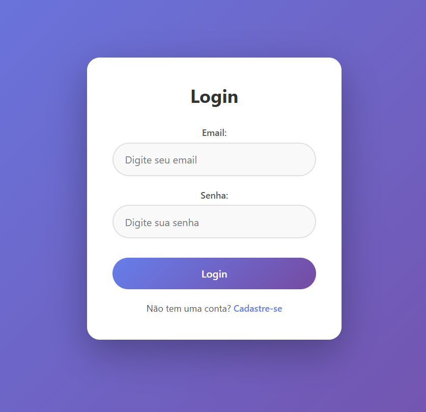
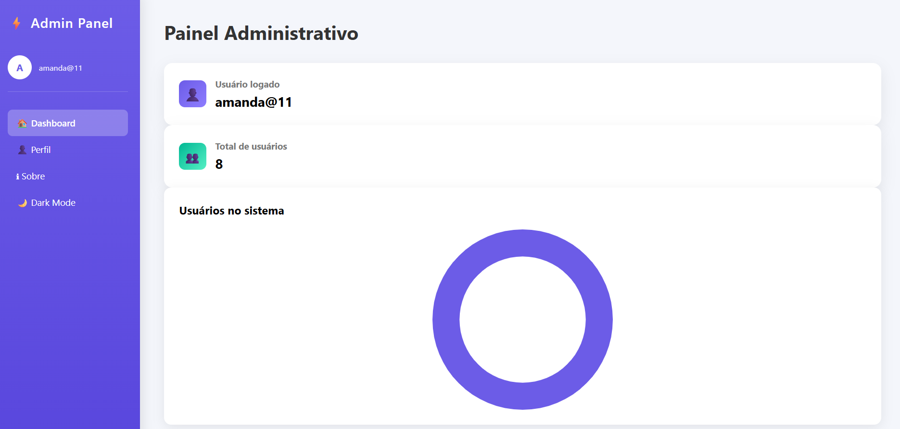
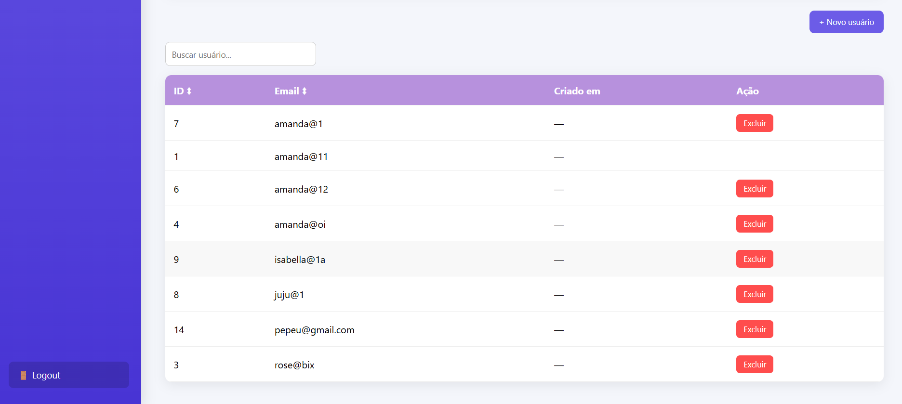

# Painel Administrativo de Usuários

Sistema web completo para **gerenciamento de usuários**, com autenticação, dashboard administrativo, visualização de dados e operações CRUD.

Este projeto foi desenvolvido como prática de desenvolvimento **full stack**, integrando **frontend em HTML/CSS/JavaScript** com **backend em Python** e consumo de API.

---

## Funcionalidades

* Login com autenticação
* Dashboard administrativo
* Visualização do usuário logado
* Contador de usuários cadastrados
* Gráfico de usuários no sistema
* Listagem de usuários
* Criação de novos usuários
* Exclusão de usuários
* Busca de usuários
* Ordenação da tabela
* Dark Mode
* Interface moderna com modais

---

## Tecnologias Utilizadas

### Frontend

* HTML5
* CSS3
* JavaScript
* Chart.js

### Backend

* Python
* Flask
* API REST

### Outros

* LocalStorage para controle de sessão
* Fetch API para comunicação com backend
* Git e GitHub para versionamento

---

## Estrutura do Projeto

```
Qqrcoisa
│
├── backend
│   ├── app.py
│   ├── banco.db
│   └── rotas da API
│
├── frontend
│   ├── index.html
│   ├── dashboard.html
│   ├── perfil.html
│   ├── sobre.html
│   └── scripts JavaScript
│
└── README.md
```

---

## Como Executar o Projeto

### 1. Clonar o repositório

```
git clone https://github.com/amandabicalh/Painel-Administrativo.git
```

### 2. Acessar a pasta do projeto

```
cd Qqrcoisa
```

### 3. Executar o backend

```
cd backend
python server.py
```

O servidor será iniciado em:

```
http://127.0.0.1:5000
```

### 4. Abrir o frontend

Abra o arquivo:

```
index.html
```

no navegador.

---

## Demonstração

O sistema possui:

* Dashboard administrativo
* Gráfico de usuários
* Sistema de autenticação
* Gerenciamento completo de usuários

---

## Objetivo do Projeto

Este projeto foi desenvolvido com o objetivo de praticar:

* Desenvolvimento full stack
* Criação de APIs
* Integração frontend e backend
* Manipulação de dados
* Estruturação de dashboards administrativos

---

## Demonstração do Sistema

### Tela de Login


### Dashboard


### Tabela de usuários


### Dark Mode


---

## Autor

**Amanda Bicalho Silva**

Graduanda em Engenharia de Software pela PUC Minas.

